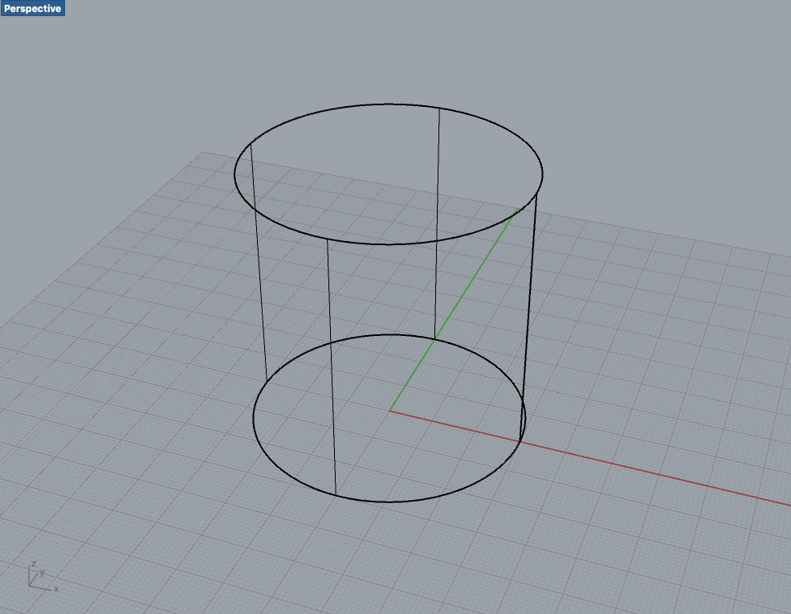

## **1-2.  3Dデータ作成時によく聞く単語**

*   **ワイヤーフレーム** \
点と稜線（エッジ）のみで3Dデータを描いたもの。
*   **ソリッド** \
粘土で作られた物体のように、中身が詰まったデータ、モデルのこと。 \
（→閉じられたデータ、モデル） \
体積や質量の概念があります。複雑な曲面、曲線の処理は苦手。
*   **サーフェス** \
ペーパークラフトのように、面や皮だけで構成されたデータ、モデルのこと。 \
（→データやモデルが閉じているかどうかは関係ない） \
フィギュアなどの有機的な形状の作成は苦手。
*   **ポリゴン** \
サーフェスの一種。サーフェスよりも細かい、線で構成された多角形。
*   **メッシュ** \
ポリゴンの集合で形状を作るデータ、モデルのこと。有機的な形状の作成が得意。
*   **レンダリング** \
3D形状の表面の色や質感、光源、影の様子や物体への映り込み、反射などを3Dソフト上で表現すること。

<table>
  <tr>
   <td>

ワイヤーフレームモデル

   </td>
   <td>

ソリッドモデル

   </td>
  </tr>
  <tr>
   <td>

サーフェスモデル

   </td>
   <td>

メッシュモデル

   </td>
  </tr>
</table>
