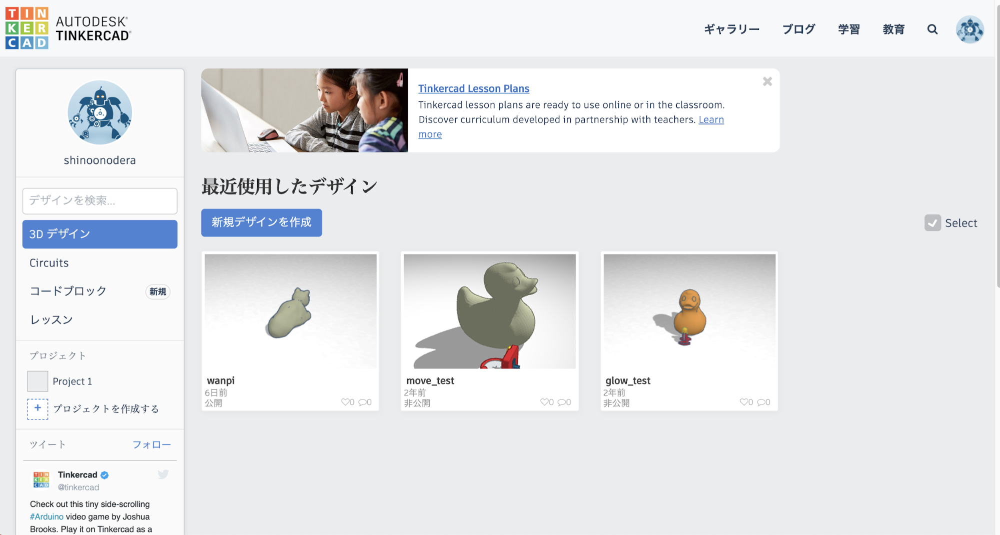

## **1-6.  モデリングツールのセットアップ**

ここまで様々なソフトやツールを紹介してきましたが、今回のコースでは「[Tinkercad](https://www.tinkercad.com/)」と「[SculptGL](https://stephaneginier.com/sculptgl/)」を使用します。

##### **(1) Tinkercadを使うには？（要会員登録）**

1. Tinkercadのウェブサイトにアクセスする。 \
[https://www.tinkercad.com/](https://www.tinkercad.com/)
2. 右上の「今すぐ参加」をクリック。
3. “Tinkercadを開始”と表示されるので、「パーソナルアカウントを作成」を選択。
4. 任意の方法で情報を登録し、アカウントを作成する。
5. アカウントが作成できたら、上記ウェブサイトで「サインイン」をクリック。
6. 以下のような画面が表示されたら、サインイン完了です！

##### **(2) SculptGLを使うには？**

使用する方法は3パターンあります。どれも会員登録は不要です。お好きな方法でどうぞ！

1. 以下のサイトにアクセスし、ブラウザ上で使用する。[https://stephaneginier.com/sculptgl/](https://stephaneginier.com/sculptgl/)
2. 以下のサイトで、Google Chromeのアプリとして追加し、使用する。 \
[https://chrome.google.com/webstore/detail/sculptgl/nekbajpiaklffelkfhkjgfbggpehnpcp](https://chrome.google.com/webstore/detail/sculptgl/nekbajpiaklffelkfhkjgfbggpehnpcp)
3. （Windowsを使用している場合）以下のサイトからダウンロードし、使用する。 \
[https://stephaneginier.com/archive/standalone/](https://stephaneginier.com/archive/standalone/)
