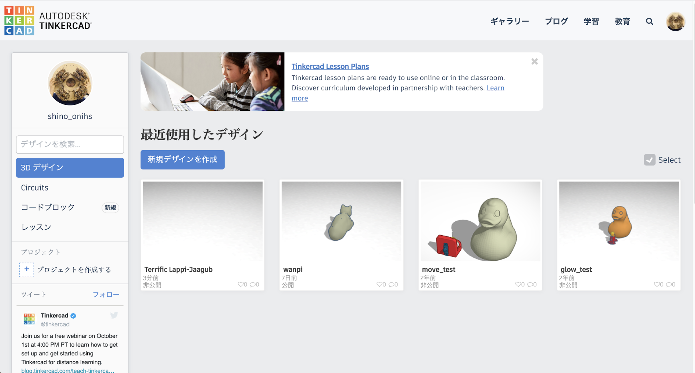
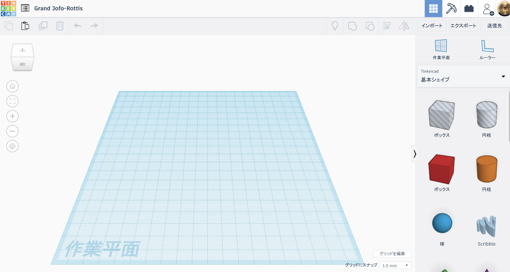

## **2-1. 画面の見方とマウス操作ついて**

<table>
  <tr>
   <td>
    
   </td>
   <td>ログインするとこんな画面が表示されます。表示言語は、ページ下部からのプルダウンメニューで変更することが可能です。
   </td>
  </tr>
</table>

<ul>

<li>3Dデザイン：3Dデータの作成。

<li>Circuits：回路の設計とシミュレーション。

<li>コードブロック：プログラムで3Dデータ作成。

<li>レッスン：上部メニューの“学習”で行ったレッスン内容が表示される。

<li>プロジェクト：フォルダのようなもの。

<li>ギャラリー：他のユーザーが作ったデータを見たり、自分のアカウントで開いて改変することができる。

<li>ブログ：Tinkercadの新機能やTipsが紹介されている。（英語のみ）

<li>学習：Tinkercadの使い方を学ぶことができる。（非常におすすめです！）

<li>教育：Tinkercadの使い方の指導方法に関するリソース。
</li>
</ul>

<table>
  <tr>
    <td>
      
    </td>
    <td>
      “3Dデザイン”を選択し、「新規デザインを作成」をクリックすると、このような画面が表示されます。
    </td>
  </tr>
</table>

<ul>
<li>左上のカラフルなアイコン：TOPページ（Dashboard）に戻る。

<li>“最近使用したデザイン”：自分の作成したデザインのリストを表示。新規作成。

<li>ファイル名：勝手に名前が付けられていますが、クリックして変更可能です。

<li>“3Dデザイン”：3Dデータを作成するための画面

<li>“ブロック”：3DデータをMinecraft用のデータに変換

<li>“レンガ“：レゴでの作成イメージに変換（画像データのみダウンロード可能）

<li>左クリック：オブジェクトの選択

<li>右長押し&ドラッグ：作業平面の回転

<li>マウスホイールを上下：拡大縮小

<li>マウスホイールを長押し&ドラッグ：画面の移動

<li>Shiftを押しながら右長押し&ドラッグ：画面の移動

<li>Shiftを押しながら左クリック：オブジェクトを複数選択 \
（選択を解除する場合は、解除したいオブジェクトを再度クリック）
※視点は基本的にマウスで変えますが、画面左側のメニューでも変えることできます。
</ul>
