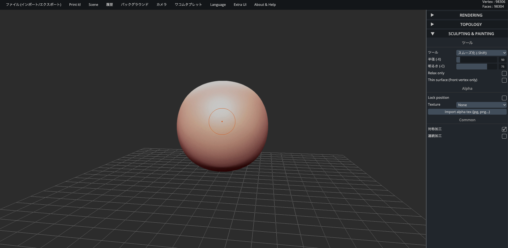

## **3-1. 画面の見方とマウス操作ついて**

ログインするとこんな画面が表示されます。表示言語は、ページ上部の“Language”で変更可能です。

<ul>

<li>RENDERGING：どんな見た目にするかを設定。</li>

<li>TOPOLOGY：ポリゴンの分割方法を設定。</li>

<li>SCULPTING & PAINTING：3Dデータを作成。</li>

<li>点がオレンジの状態で左長押し&ドラッグ：作業平面の回転</li>

<li>点が赤い状態で左長押し&ドラッグ：オブジェクトの変形など</li>

<li>点が赤い状態で、altを押しながら左長押し&ドラッグ：オブジェクトの逆変形など</li>

<li>右長押し&ドラッグ：作業平面の回転</li>

<li>マウスホイールを上下：拡大縮小</li>

<li>マウスホイールを長押し&ドラッグ：画面の移動</li>

<li>altを押しながら左長押し&ドラッグ：画面の移動</li>

<li>altを押しながら右長押し&ドラッグ：画面の移動
※視点は基本的にマウスで変えますが、画面上部の“カメラ”メニューでも変えることできます。</li>
</ul>

