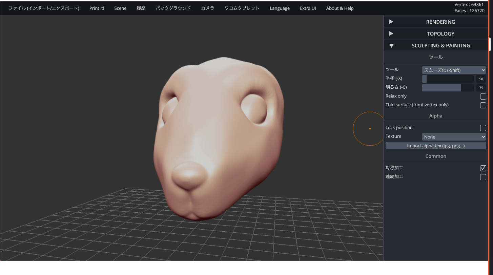

## **3-2. データの読込方法**

<table>
  <tr>
   <td>

   </td>
   <td>(1)

画面を開きます。
   </td>
  </tr>
  <tr>
   <td>

   </td>
   <td>(2)

上部メニューから“Scene”を開いて“Clear scene”を選択し、球体を消去します。
   </td>
  </tr>
  <tr>
   <td>

   </td>
   <td>(3)

上部メニューから“ファイル（インポート/エクスポート）”を開いて、Importの“Add”を選択し、データを読み込みます。
   </td>
  </tr>
  <tr>
   <td>

   </td>
   <td>(4)

データが正常に読み込まれました。
   </td>
  </tr>
</table>
